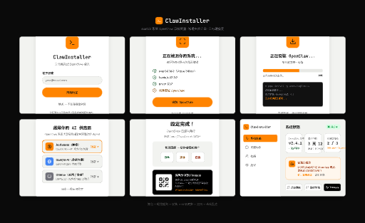

<h1 align="center">ClawInstaller</h1>

<p align="center">
  <strong>Install OpenClaw in 3 minutes instead of 30.</strong><br>
  A native macOS GUI wizard that automates the painful setup process.
</p>

<p align="center">
  <a href="https://github.com/clawinstaller/claw-installer/releases"></a>
  <a href="https://github.com/clawinstaller/claw-installer/stargazers"></a>
  <a href="https://github.com/clawinstaller/claw-installer/releases"></a>
  <a href="https://swift.org"></a>
  <a href="https://www.apple.com/macos"></a>
  <a href="LICENSE"></a>
</p>

<p align="center">
  <a href="README.md">繁體中文</a> ·
  <a href="https://clawinstaller.github.io/website/en/">Documentation</a> ·
  <a href="https://t.me/clawinstaller">Telegram</a> ·
  <a href="https://www.threads.net/@0xhoward_peng">Threads</a>
</p>

---

<!-- TODO: Replace with actual demo GIF once recorded -->
<p align="center">
  
</p>

## The Problem

[OpenClaw](https://github.com/openclaw/openclaw) has **257K+ stars** and 3.1K open issues. A large chunk are installation problems:

| Pain Point | % of new user issues | ClawInstaller fix |
|-----------|---------------------|-------------------|
| Wrong Node.js version, missing native deps | ~35% | Auto-detect + one-click fix |
| Config file confusion (JSON, API keys) | ~25% | Step-by-step guided wizard |
| "It installed but won't start" | ~15% | Smart error diagnosis + fix |

**We automate the painful first 5 minutes** — the stage where most people give up.

## Download

### Direct Download (Recommended)

> **[Download .dmg from GitHub Releases](https://github.com/clawinstaller/claw-installer/releases)**

### Build from Source

```bash
git clone https://github.com/clawinstaller/claw-installer.git
cd claw-installer
swift build
swift run ClawInstaller
```

Requires macOS 14+ (Sonoma), Xcode 15+ or Swift 6.0 toolchain.

## Features

| Module | Status | Description |
|--------|--------|-------------|
| **Environment Check** | Done | Node.js >=22, package managers, CPU arch, disk space. One-click fix. |
| **One-Click Install** | Done | Install via npm/pnpm/bun with real-time terminal output |
| **LLM Setup** | Done | Anthropic (OAuth + API key), Google Gemini, Ollama. Detects existing config. |
| **Channel Setup** | Done | Telegram, Discord, WhatsApp — step-by-step with token validation |
| **Skills Install** | Done | Select and install OpenClaw skills with one click |
| **Done + Share** | Done | Installation summary, QR code sharing to Threads/X |
| **Health Monitor** | Planned | Gateway status, daemon controls, log viewer |
| **AI Assistant** | Planned | AI-powered troubleshooting with full install context |

## How It Works

```
Welcome -> Preflight -> Install -> LLM Setup -> Channels -> Skills -> Done!
              |                                                         |
         Found issues?                                          Scan QR Code
         One-click fix                                        Share to Threads
```

## Smart Error Handling

| Error | Auto-Fix |
|-------|----------|
| Node.js missing | One-click install via Homebrew |
| Native module build failure | One-click Xcode CLI Tools install |
| Network timeout | Retry / switch registry mirror |
| `openclaw` command not found | PATH auto-detection + fix |
| Existing LLM config detected | Shows current config, option to skip or reconfigure |

## Pricing

**Completely free.** No hidden costs, no premium tier.

## Community

- **Docs**: [clawinstaller.github.io/website/en](https://clawinstaller.github.io/website/en/) (English + 繁中)
- **Threads**: [@0xhoward_peng](https://www.threads.net/@0xhoward_peng)
- **Telegram**: [@clawinstaller](https://t.me/clawinstaller)

## Contributing

Early stage — all contributions welcome:

1. **Test it** on your Mac, [report issues](https://github.com/clawinstaller/claw-installer/issues)
2. **Share pain points** about OpenClaw setup
3. **PRs welcome** — check open issues

## License

[MIT](LICENSE)

---

<p align="center">
  Built by <a href="https://github.com/howardpen9">@howardpen9</a> with OpenClaw agents (Friday, Shuri, Muse)<br>
  <sub>Independent community project, not affiliated with OpenClaw.</sub>
</p>
